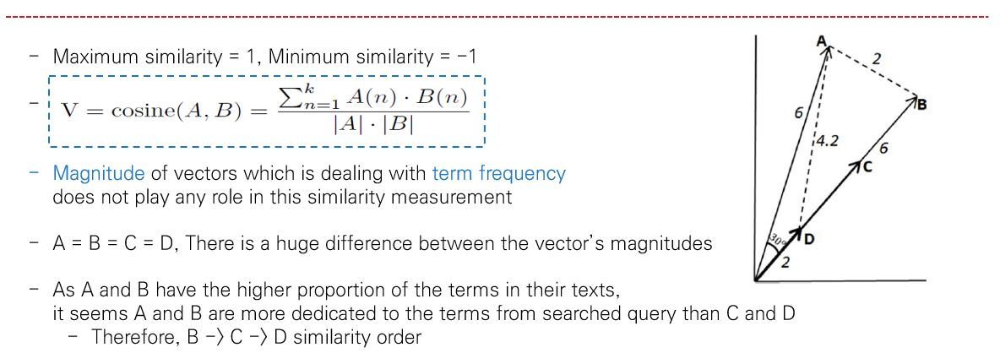
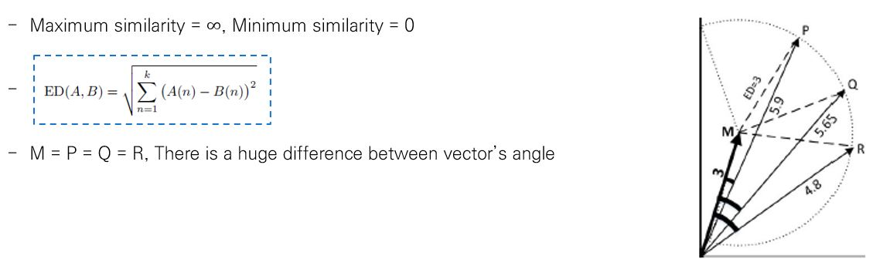
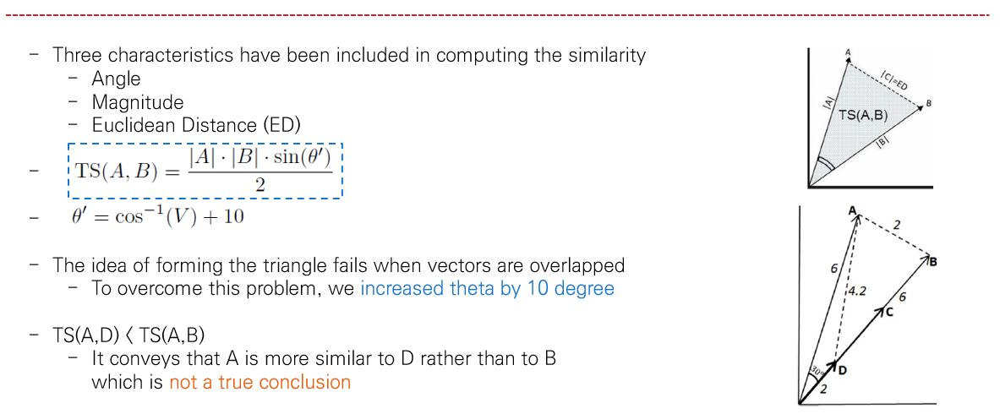
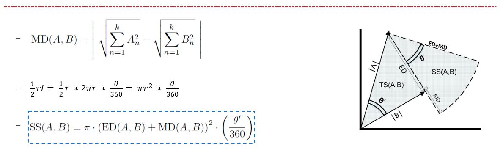
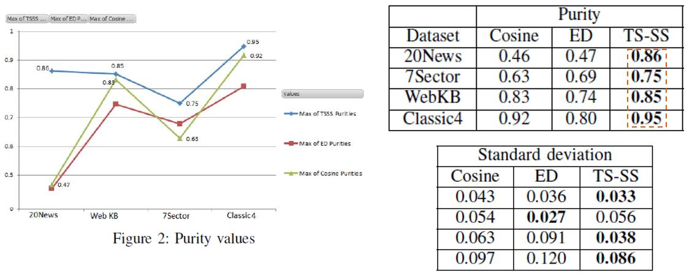
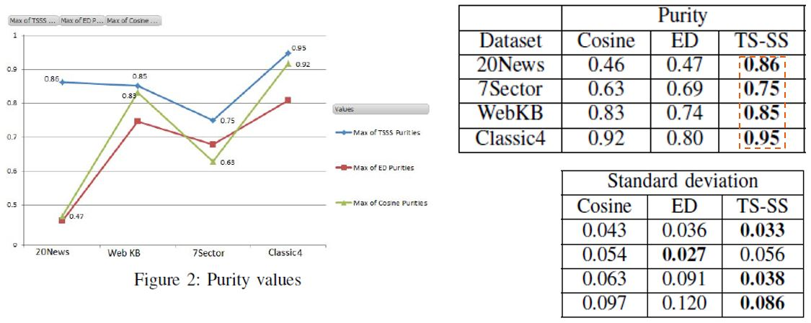

# Vector_Similarity
* Python, Java implementation of TS-SS called from "A Hybrid Geometric Approach for Measuring Similarity Level Among Documents and Document Clustering"
* I recommend TS-SS instead of Cosine distance or Euclidean distance.

# The reasons are... :

## Cosine drawbacks

## Euclidean drawbacks

## Triangle's Area Similarity (TS)

## Sector's Area Similarity (SS)

## TS-SS

## Results

## Conclusion
* In biggest dataset, TS-SS outperforms Cosine with a significant difference, while in other datasets TS-SS outperforms Cosine slightly

* Therefore, the significant better result of TS-SS in biggest dataset justifies the robustness and reliability of the model for big data and real world data where the variety of documents/texts are high

## Reference
[1] A Hybrid Geometric Approach for Measuring Similarity Level Among Documents and Document Clustering [link1](https://www.computer.org/csdl/proceedings/bigdataservice/2016/2251/00/2251a142.pdf) [link2](http://ieeexplore.ieee.org/document/7474366/)

